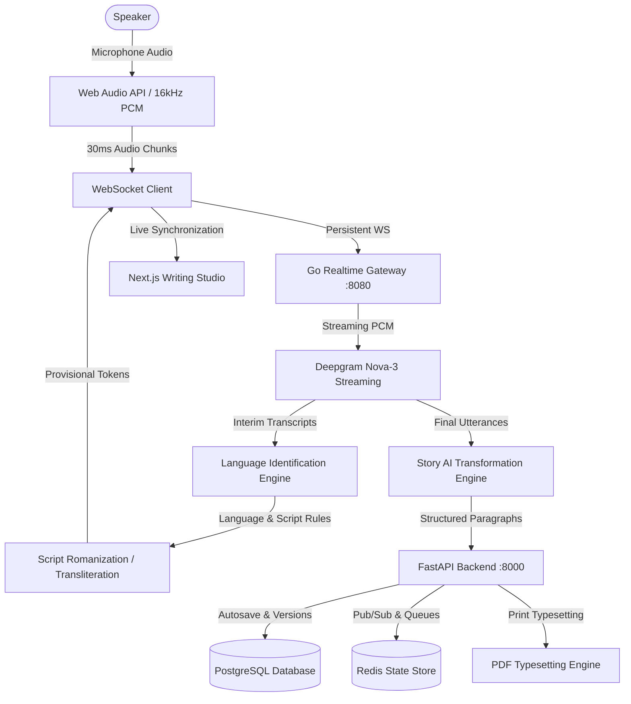

# StoryFlow System Architecture Specification

## 1. Executive Summary
StoryFlow is an industrial-grade, voice-first AI writing studio designed for professional authors, screenwriters, poets, and storytellers who think and create faster by speaking. The platform captures continuous microphone audio in small 20–40ms PCM frames, streams them over a persistent WebSocket gateway, processes real-time speech recognition, preserves spoken language identity (specifically supporting Romanized Telugu/Teluglish and Romanized Hindi/Hinglish without unwanted English translation), and renders polished prose live into a distraction-free writing canvas.

---

## 2. End-to-End Realtime Architecture

---

## 3. Core Architectural Principles

### 3.1 Non-Negotiable Language Preservation
Most off-the-shelf voice assistants aggressively translate Indic languages into English. StoryFlow treats language preservation as an inviolable contract:

1. **Transcription != Transliteration != Translation != Rewriting**:
   - **Transcription**: Converting acoustic waveforms to linguistic characters.
   - **Transliteration**: Mapping native graphemes to the Latin/Roman alphabet (e.g. Telugu script to Teluglish, Devanagari to Hinglish) while keeping words identical.
   - **Translation**: Converting words into an entirely different language (e.g. Telugu to English).
   - **Rewriting**: Stylistic refinement of flow, grammar, and punctuation.
2. **Default Behavior**:
   - **Telugu speech**: "A roju nenu morning hospital ki vellanu." -> Preserved verbatim as Roman Telugu.
   - **Hindi speech**: "Us din main hospital gaya tha." -> Preserved verbatim as Roman Hindi.
   - **English speech**: Preserved as English.
   - The engine **NEVER** silently translates Telugu or Hindi into English unless the user explicitly requests translation.

### 3.2 Anti-Hallucination Contract
StoryFlow enforces a strict system prompt instruction across all AI stages:
> "You are a transcription-to-writing transformation engine. You must preserve factual content. Do not invent characters, events, locations, emotions, dialogue, actions, descriptions, dates, or facts that are not present in the source content."

Two distinct modes provide user control:
- **Faithful Mode**: Corrects punctuation, casing, spacing, and disfluencies (um, uh, stuttered words) with zero semantic modification.
- **Literary Mode**: Enriches prose cadence and evocative tone while strictly preserving all underlying facts.

### 3.3 Ultra-Low Latency Budget
| Pipeline Stage | Target Latency (P50) | Target Latency (P95) |
|----------------|----------------------|----------------------|
| Audio Capture & Resampling | 25 ms | 35 ms |
| WebSocket Transit | 10 ms | 25 ms |
| STT First Partial Token | 180 ms | 260 ms |
| Script Normalization | 5 ms | 15 ms |
| Editor Render | 8 ms | 16 ms |
| **Speech-to-Visible-Text** | **< 250 ms** | **< 350 ms** |

---

## 4. Multi-Layer Component Stack

### 4.1 Frontend (`apps/web`)
- **Framework**: Next.js 14 (App Router) + React 18 + TypeScript
- **Styling**: Tailwind CSS with custom writer-focused typography (`Charter`, `Georgia`, `Inter`)
- **State**: Zustand for reactive, lightweight state without unnecessary re-renders
- **Audio Capture**: Web Audio API (`AudioContext`, `ScriptProcessorNode` / `AudioWorkletNode`) resampling input audio to 16,000 Hz 16-bit mono PCM in 30ms slices
- **Editor UX**: Two-way document ownership. User can edit previous paragraphs while speech dictation streams without losing cursor position or overwriting text.

### 4.2 Realtime Gateway (`apps/realtime`)
- **Language**: Go 1.22
- **Network**: Highly concurrent WebSocket server built on `gorilla/websocket`
- **Responsibilities**: Session tracking, client authentication verification, binary audio multiplexing, backpressure management, sequence tracking, and heartbeats.

### 4.3 Application Backend (`apps/api`)
- **Framework**: FastAPI (Python 3.11) + SQLAlchemy 2.0 (asyncio) + Pydantic v2
- **Responsibilities**: Authentication, Projects, Stories, Versions, AI transformation endpoints, Export jobs, Observability probes.
- **Database Engine**: PostgreSQL with `asyncpg` connection pooling for production; `aiosqlite` for zero-setup local development.

### 4.4 Data Model & Entity Schema
- `users`: User identity and credentials (hashed with bcrypt/argon2).
- `projects`: Workspace container for stories.
- `stories`: Canonical story entity with separate fields for `raw_transcript` and `processed_text`.
- `documents`: Document JSON and plain text versions.
- `story_versions`: Immutable historical snapshots with word counts, diff summaries, and one-click rollback.
- `story_sessions`: Tracking audio seconds and transcription connection logs.
- `characters`, `locations`, `story_events`: Structured narrative memory.
- `exports`: PDF and document typesetting jobs.
